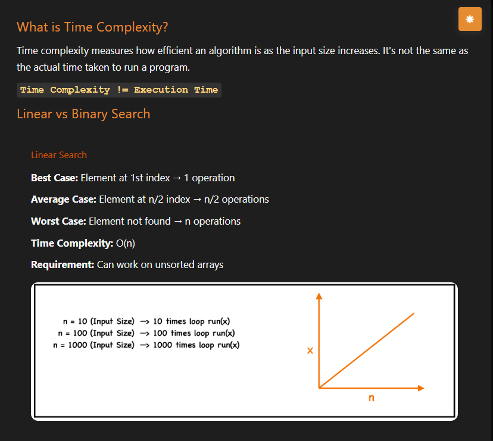
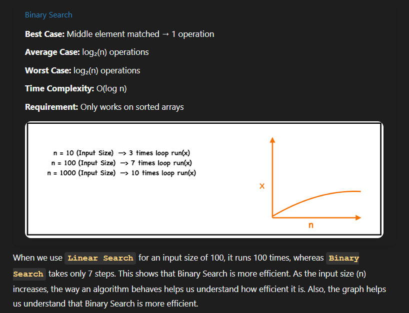
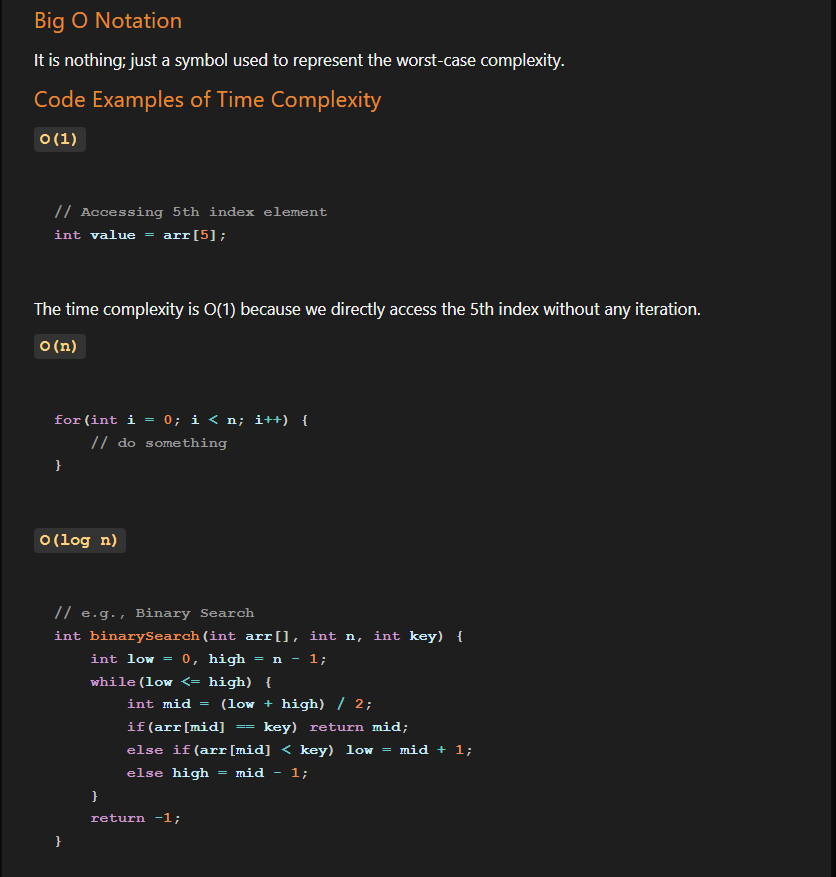
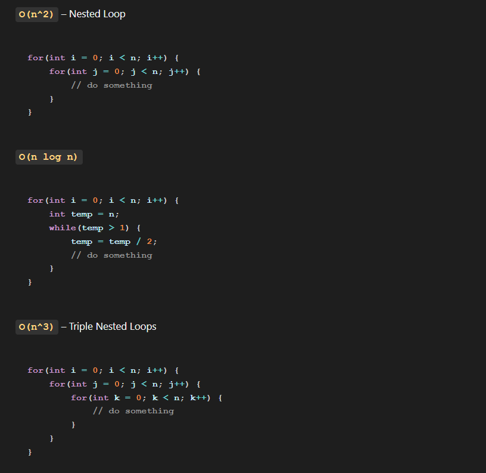
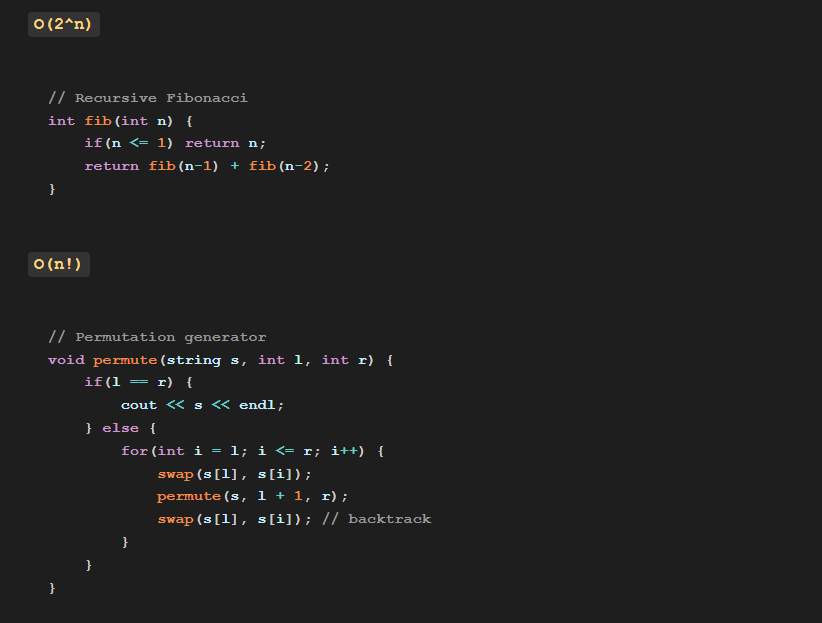
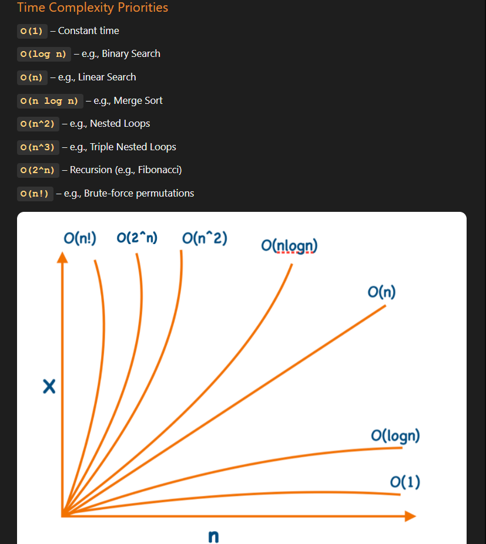
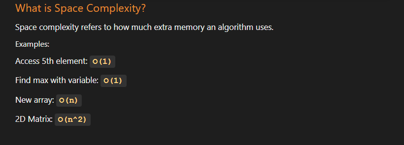

## <p style="text-align: center; font-size: 20px; font-weight: bold ;color: #e68a00">Time Complexity</p>

Time complexity is a way to describe how the running time of an algorithm increases as the input size increases.

In simple words:

It tells us how fast or slow a program becomes when the amount of data grows.

Time complexity is not the actual execution time of the code. It is how the execution time grows when the input size increases.

| Concept             | Meaning                                        |
| ------------------- | ---------------------------------------------- |
| **Execution time**  | Actual time taken (e.g., 5 ms, 2 seconds)      |
| **Time complexity** | Growth pattern of time as input size increases |


### How to quickly identify time complexity just by looking at code?

You can identify time complexity of most code using just 3 simple rules.

**1️⃣ Count the Loops**

If a loop runs n times, the time complexity is O(n).

Example(Linear Search):

```js
  for(let i = 0; i < n; i++){
    console.log(i);
  }
```

Loop runs n times.

✅ Time complexity = O(n)

**2️⃣ Nested Loops Multiply**

If one loop is inside another, multiply their sizes.

Example:

```js
  for(let i = 0; i < n; i++){
    for(let j = 0; j < n; j++){
        console.log(i, j);
    }
  }
```

Outer loop → n times
Inner loop → n times

Total operations = n × n

✅ Time complexity = O(n²)

**3️⃣ If Input Gets Divided → Logarithmic**

Example (Binary Search):

```js
  while(left <= right){
    mid = Math.floor((left + right) / 2)

    if(arr[mid] === target) return mid
    else if(arr[mid] < target) left = mid + 1
    else right = mid - 1
  }
```

Each step cuts the array in half.

✅ Time complexity = O(log n)

### Quick Cheat Sheet

| Code Pattern           | Time Complexity |
| ---------------------- | --------------- |
| Single loop            | O(n)            |
| Two nested loops       | O(n²)           |
| Three nested loops     | O(n³)           |
| Divide problem by half | O(log n)        |
| Loop + log operation   | O(n log n)      |
| No loop                | O(1)            |


```js
  for(let i = 0; i < n; i++){
    console.log(i);
  }

  for(let j = 0; j < n; j++){
    console.log(j);
  }
```

Two loops but not nested.

Operations = n + n = 2n

In Big-O we ignore constants, because constant is not significant

✅ Time complexity = O(n)

Golden Rules of Big-O

1️⃣ Ignore constants
O(2n) → O(n)

2️⃣ Keep the highest power
O(n² + n) → O(n²)

3️⃣ Drop smaller terms
O(n + log n) → O(n)

✅ Simple memory trick

| Pattern        | Complexity |
| -------------- | ---------- |
| Direct access  | O(1)       |
| Divide by half | O(log n)   |
| One loop       | O(n)       |
| Sort           | O(n log n) |
| Nested loops   | O(n²)      |

### Array methods time complexity (map, filter, reduce, push, shift, etc.)

Below are the most common array operations and their time complexities.

**JavaScript Array Methods Time Complexity**

| Method       | Time Complexity | Reason                           |
| ------------ | --------------- | -------------------------------- |
| `push()`     | **O(1)**        | Adds element at the end          |
| `pop()`      | **O(1)**        | Removes element from end         |
| `shift()`    | **O(n)**        | All elements must shift left     |
| `unshift()`  | **O(n)**        | All elements must shift right    |
| `map()`      | **O(n)**        | Iterates through entire array    |
| `filter()`   | **O(n)**        | Checks every element             |
| `reduce()`   | **O(n)**        | Processes each element           |
| `forEach()`  | **O(n)**        | Visits every element             |
| `find()`     | **O(n)**        | May check all elements           |
| `includes()` | **O(n)**        | Linear search                    |
| `indexOf()`  | **O(n)**        | Linear search                    |
| `slice()`    | **O(n)**        | Copies part of array             |
| `splice()`   | **O(n)**        | May shift elements               |
| `concat()`   | **O(n)**        | Creates new array                |
| `sort()`     | **O(n log n)**  | Uses efficient sorting algorithm |

**Big O describes the growth rate of an algorithm’s time or space when input size becomes large**













O(1) > O(log n) > O(n) > O(n log n) > O(n^2) > O(2^n) > O(n!)

## <p style="text-align: center; font-size: 20px; font-weight: bold ;color: #e68a00"> Space Complexity</p>

Space Complexity means how much memory (space) an algorithm needs to run, based on the size of the input.

Just like time complexity tells how execution time grows, space complexity tells how memory usage grows when input size increases.

Simple Example:

Example 1:

```js
  function sum(arr){
    let total = 0;
    for(let i = 0; i < arr.length; i++){
      total += arr[i];
    }
    return total;
  }
```

Space used:

- total
- i

These are fixed variables, regardless of array size.
👉 Space Complexity = O(1) (Constant space)

Example 2:

```js
  function copyArray(arr){
    let newArr = [];
    for(let i = 0; i < arr.length; i++){
      newArr.push(arr[i]);
    }
    return newArr;
  }
```

Here:

- A new array is created.
-If input has n elements, new array also stores n elements.

👉 Space Complexity = O(n)

### Key Idea:

| Input Size              | Memory Used | Space Complexity |
| ----------------------- | ----------- | ---------------- |
| Same memory always      | Constant    | **O(1)**         |
| Memory grows with input | Linear      | **O(n)**         |
| Memory grows n × n      | Quadratic   | **O(n²)**        |

### Important Note

Space complexity includes:

1. Variables
2. Data structures created (arrays, objects, etc.)
3. Function call stack (recursion)

### Quick Way to Think

- No extra memory used → O(1)
- Extra array/object proportional to input → O(n)
- 2D structures → O(n²)

