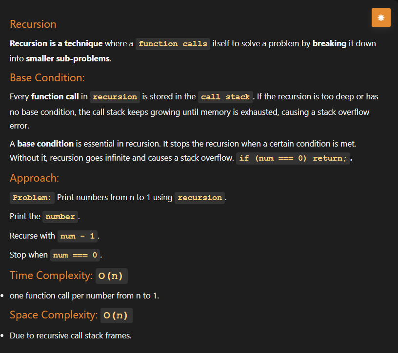
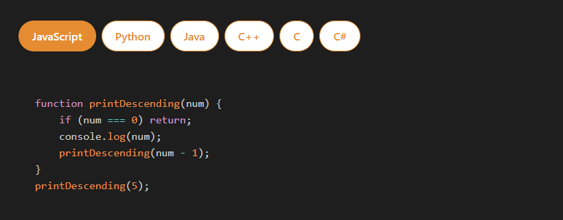
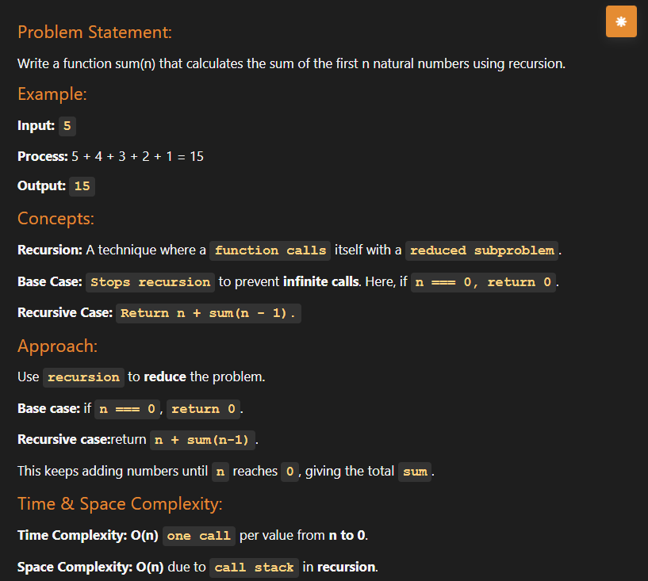
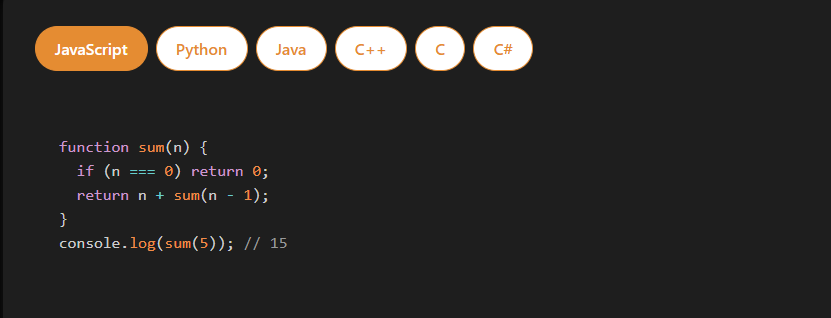
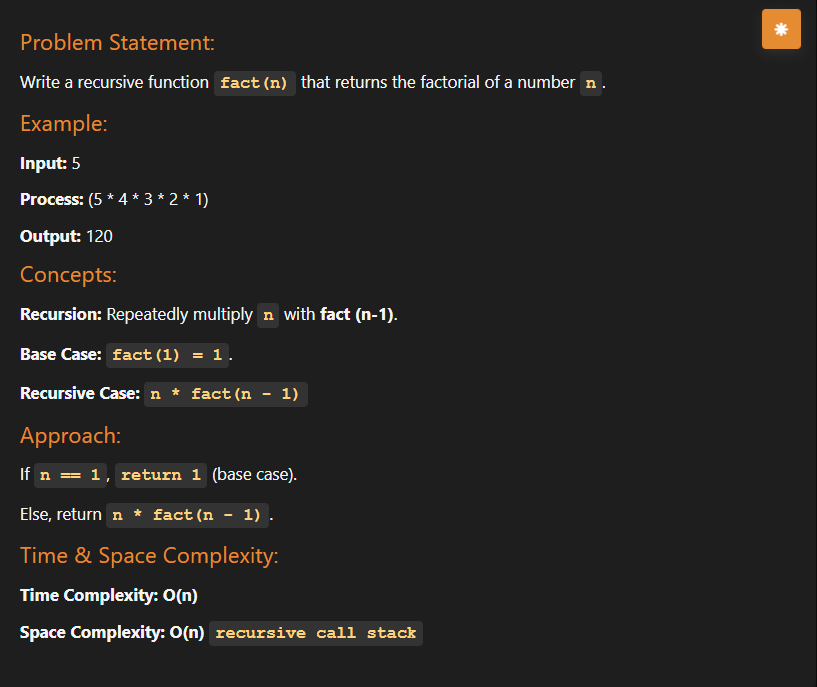
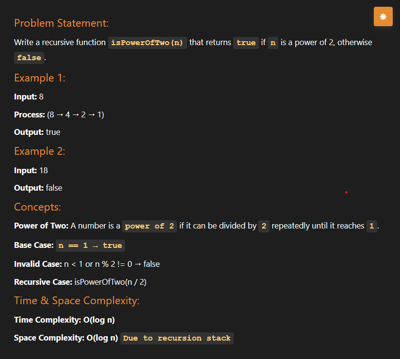
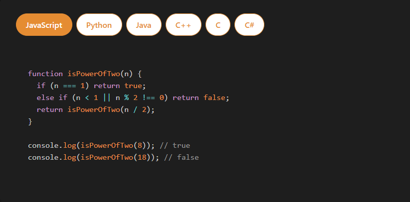
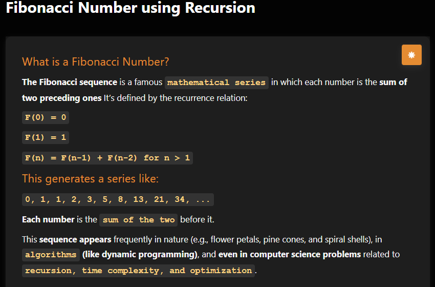
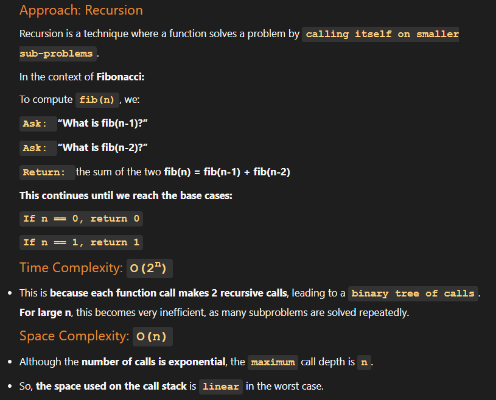
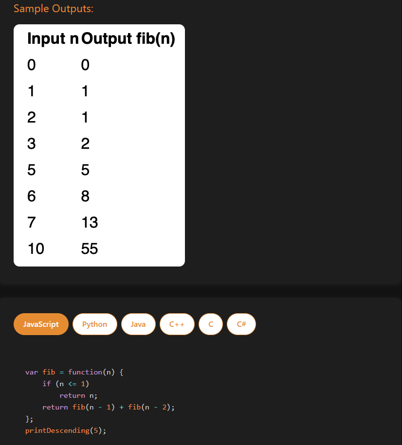

# Section 4 : Recursion - Easy/medium

## <p style="text-align: center; font-size: 20px; font-weight: bold ;color: #e68a00">Recursion 101</p>

Recursion is a programming technique where a function calls itself directly or indirectly to solve complex problems by breaking them into smaller, similar sub-problems. It requires a base case to halt recursion and a recursive case to continue, functioning similarly to a dream within a dream in Inception. 

### Key Components of Recursion:

- **Base Case:** The condition that stops the recursion. Without it, the function will run indefinitely, resulting in a stack overflow error.

- **Recursive Case:** The part of the function where it calls itself with a smaller input.

- **Stack Memory:** Each function call is added to the stack, creating a new copy of local variables. Once the base case is reached, the calls return and are removed from the stack. 

### Key Advantages and Uses:

- **Complexity:** Simplifies complex problems that can be divided into sub-problems.

- **Data Structures:** Used in navigating data structures like trees, graphs, and fractals.

- **Algorithms:** Commonly used in algorithms like merge sort, quick sort, and binary search. 





## <p style="text-align: center; font-size: 20px; font-weight: bold ;color: #e68a00">Sum of first n numbers</p>





## <p style="text-align: center; font-size: 20px; font-weight: bold ;color: #e68a00">Sum of all numbers in Array</p>

```js
  function sumArray(arr) {
    if (arr.length === 0) return 0;
    return arr[0] + sumArray(arr.slice(1));
  }

  const arr1 = [6, 3, 5, 6, 2];
  console.log(`sum of ${arr1} is ${sumArray(arr1)}`);
```

## <p style="text-align: center; font-size: 20px; font-weight: bold ;color: #e68a00">Factorial of n</p>



```js
  function factorial(n) {
    if(n===1) return 1;

    return n * factorial(n-1);
  }

  console.log(`Factorial of 5 is ${factorial(5)}`);
```

## <p style="text-align: center; font-size: 20px; font-weight: bold ;color: #e68a00">Power of Two</p>





## <p style="text-align: center; font-size: 20px; font-weight: bold ;color: #e68a00">Recusrsion masterclass</p>





